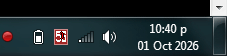
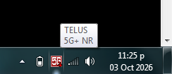
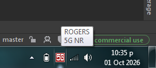
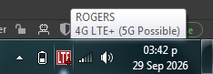
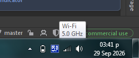
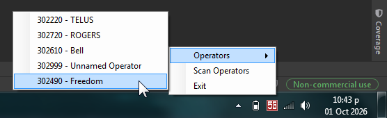

# SystemTrayCellularIndicator (or "SystemTrayThing")

### Warning
I've never really worked with C# or the Windows APIs before, and parts of this program were AI-assisted.
There's probably a lot of poor programming practices used in here. This is mostly a little side project
thing that I didn't put a lot of effort into. "It works on my machine", but it might require modifications to work on yours.

### Screenshots

